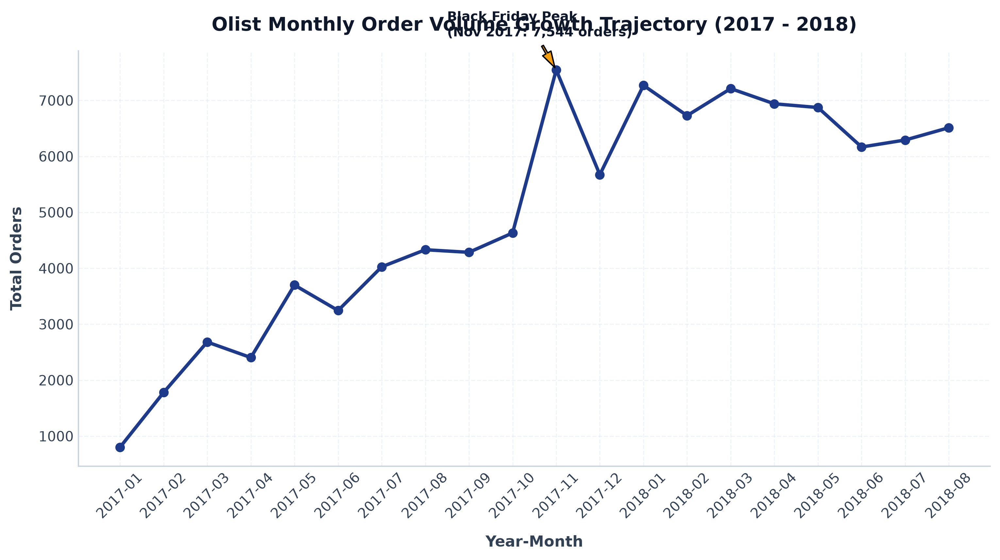
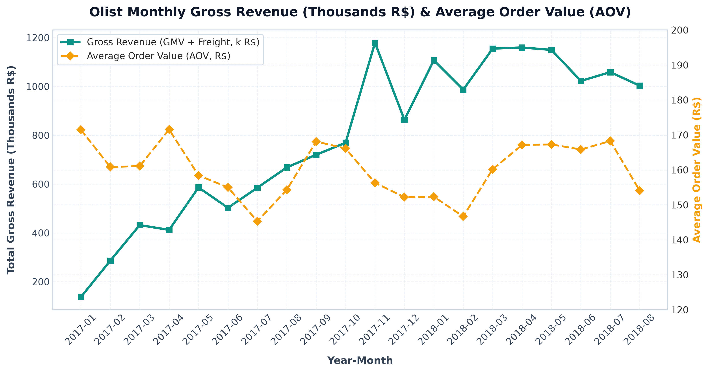
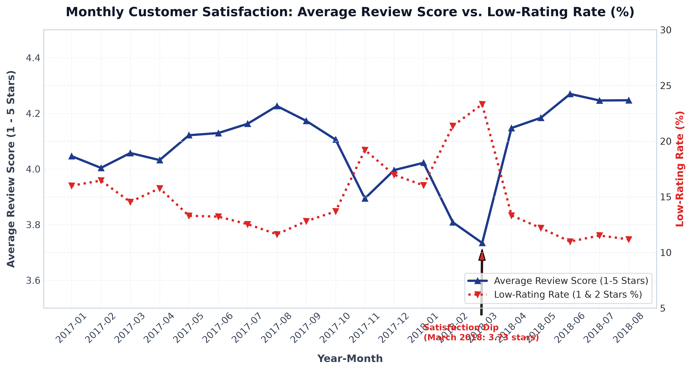

# Core Question 1 Analysis Findings
## Marketplace Volume, Revenue, and Satisfaction Trends Over Time

---

## 1. Executive Summary

This document presents the formal empirical analysis for **Core Question 1**:
> *How have order volume, revenue, and review scores trended across the available period? Did marketplace growth and customer satisfaction move together?*

Based on the validated master dataset of **99,441 orders** spanning September 2016 through October 2018, the analysis demonstrates that:
1. **Marketplace Scaling**: Order volume expanded by **+714%** during the core operating period, rising from **800 orders** in January 2017 to **6,512 orders** in August 2018. Total platform revenue reached **R$ 15,843,553.24** (R$ 13.59M GMV + R$ 2.25M Freight).
2. **Revenue Trajectory**: Monthly gross revenue expanded from **R$ 137,188.49** (Jan 2017) to a peak of **R$ 1,179,143.77** during Black Friday (Nov 2017), sustaining over **R$ 1.0M/month** throughout mid-2018.
3. **AOV Stability**: Average Order Value (AOV) remained stable between **R$ 145 and R$ 171** per order throughout 2017 and 2018, averaging **R$ 160.58** overall.
4. **Growth vs. Satisfaction Co-Movement**: Marketplace volume/revenue growth and customer satisfaction **did NOT move together** in a long-term downward or upward trend. The correlation between monthly order volume and average review score is near zero ($r = -0.1266$).
5. **Operational Bottleneck Coupling**: Monthly customer satisfaction fluctuates in direct alignment with **logistics delivery late rates** ($r = +0.7940$). Satisfaction drops sharply during volume spikes (Black Friday Nov 2017 and March 2018 logistics backlogs) due to carrier delays, but recovers rapidly when delivery late rates subside.

---

## 2. Complete Monthly Performance Table ($N = 99,441$)

| Purchase Month (`YYYY-MM`) | Total Orders ($N$) | Gross Revenue (R$) | GMV (R$) | Freight (R$) | Average Order Value (AOV R$) | Average Review Score (1-5) | Low-Rating Count (1-2 Stars) | Low-Rating Rate (%) | Delivered Orders ($N$) | Late Delivery Count | Late Delivery Rate (%) |
| :---: | :---: | :---: | :---: | :---: | :---: | :---: | :---: | :---: | :---: | :---: | :---: |
| **2016-09** | 4 | R$ 354.75 | R$ 267.36 | R$ 87.39 | R$ 88.69 | 1.00 | 4 | 100.00% | 1 | 1 | 100.00% |
| **2016-10** | 324 | R$ 56,808.84 | R$ 49,507.66 | R$ 7,301.18 | R$ 175.34 | 3.52 | 98 | 30.25% | 265 | 3 | 1.13% |
| **2016-12** | 1 | R$ 19.62 | R$ 10.90 | R$ 8.72 | R$ 19.62 | 5.00 | 0 | 0.00% | 1 | 0 | 0.00% |
| **2017-01** | 800 | R$ 137,188.49 | R$ 120,312.87 | R$ 16,875.62 | R$ 171.49 | 4.05 | 128 | 16.00% | 750 | 23 | 3.07% |
| **2017-02** | 1,780 | R$ 286,280.62 | R$ 247,303.02 | R$ 38,977.60 | R$ 160.83 | 4.00 | 293 | 16.46% | 1,653 | 53 | 3.21% |
| **2017-03** | 2,682 | R$ 432,048.59 | R$ 374,344.30 | R$ 57,704.29 | R$ 161.09 | 4.06 | 390 | 14.54% | 2,546 | 142 | 5.58% |
| **2017-04** | 2,404 | R$ 412,422.24 | R$ 359,927.23 | R$ 52,495.01 | R$ 171.56 | 4.03 | 379 | 15.77% | 2,303 | 181 | 7.86% |
| **2017-05** | 3,700 | R$ 586,190.95 | R$ 506,071.14 | R$ 80,119.81 | R$ 158.43 | 4.12 | 492 | 13.30% | 3,546 | 128 | 3.61% |
| **2017-06** | 3,245 | R$ 502,963.04 | R$ 433,038.60 | R$ 69,924.44 | R$ 155.00 | 4.13 | 429 | 13.22% | 3,135 | 121 | 3.86% |
| **2017-07** | 4,026 | R$ 584,971.62 | R$ 498,031.48 | R$ 86,940.14 | R$ 145.30 | 4.16 | 505 | 12.54% | 3,872 | 133 | 3.43% |
| **2017-08** | 4,331 | R$ 668,204.60 | R$ 573,971.68 | R$ 94,232.92 | R$ 154.28 | 4.23 | 504 | 11.64% | 4,193 | 139 | 3.32% |
| **2017-09** | 4,285 | R$ 720,398.91 | R$ 624,401.69 | R$ 95,997.22 | R$ 168.12 | 4.17 | 549 | 12.81% | 4,150 | 216 | 5.20% |
| **2017-10** | 4,631 | R$ 769,312.37 | R$ 664,219.43 | R$ 105,092.94 | R$ 166.12 | 4.11 | 634 | 13.69% | 4,478 | 237 | 5.29% |
| **2017-11 (Black Friday)** | **7,544** | **R$ 1,179,143.77** | R$ 1,010,271.37 | R$ 168,872.40 | R$ 156.30 | **3.89** | **1,449** | **19.21%** | 7,289 | 1,043 | **14.31%** |
| **2017-12** | 5,673 | R$ 863,547.23 | R$ 743,914.17 | R$ 119,633.06 | R$ 152.22 | 4.00 | 963 | 16.98% | 5,513 | 462 | 8.38% |
| **2018-01** | 7,269 | R$ 1,107,301.89 | R$ 950,030.36 | R$ 157,271.53 | R$ 152.33 | 4.02 | 1,165 | 16.03% | 7,069 | 464 | 6.56% |
| **2018-02** | 6,728 | R$ 986,908.96 | R$ 844,178.71 | R$ 142,730.25 | R$ 146.69 | 3.81 | 1,438 | 21.37% | 6,555 | 1,049 | 16.00% |
| **2018-03** | 7,211 | R$ 1,155,126.82 | R$ 983,213.44 | R$ 171,913.38 | R$ 160.19 | **3.73** | **1,681** | **23.31%** | 7,003 | **1,496** | **21.36%** |
| **2018-04** | 6,939 | R$ 1,159,698.04 | R$ 996,647.75 | R$ 163,050.29 | R$ 167.13 | 4.15 | 925 | 13.33% | 6,798 | 361 | 5.31% |
| **2018-05** | 6,873 | R$ 1,149,781.82 | R$ 996,517.68 | R$ 153,264.14 | R$ 167.29 | 4.18 | 838 | 12.19% | 6,749 | 556 | 8.24% |
| **2018-06** | 6,167 | R$ 1,022,677.11 | R$ 865,124.31 | R$ 157,552.80 | R$ 165.83 | **4.27** | 677 | **10.98%** | 6,099 | 83 | **1.36%** |
| **2018-07** | 6,292 | R$ 1,058,728.03 | R$ 895,507.22 | R$ 163,220.81 | R$ 168.27 | 4.25 | 725 | 11.52% | 6,159 | 276 | 4.48% |
| **2018-08** | 6,512 | R$ 1,003,308.47 | R$ 854,686.33 | R$ 148,622.14 | R$ 154.07 | 4.25 | 728 | 11.18% | 6,351 | 660 | 10.39% |
| **2018-09** | 16 | R$ 166.46 | R$ 145.00 | R$ 21.46 | R$ 10.40 | 1.75 | 13 | 81.25% | 0 | 0 | - |
| **2018-10** | 4 | R$ 0.00 | R$ 0.00 | R$ 0.00 | R$ 0.00 | 2.25 | 3 | 75.00% | 0 | 0 | - |
| **TOTAL / OVERALL** | **99,441** | **R$ 15,843,553.24** | **R$ 13,591,643.70** | **R$ 2,251,909.54** | **R$ 160.58** | **4.07** | **14,955** | **15.04%** | **96,470** | **7,826** | **8.11%** |

---

## 3. Volume and Revenue Growth Trajectory

### Monthly Order Scaling ($N = 99,441$)
- In Q1 2017, monthly order volume averaged **1,754 orders/month** (Jan 2017: 800 orders, Feb: 1,780, Mar: 2,682).
- By Q1 2018, monthly order volume averaged **7,069 orders/month** (Jan 2018: 7,269 orders, Feb: 6,728, Mar: 7,211), representing a **+303% year-over-year increase**.
- **Peak Order Month**: **November 2017** recorded **7,544 orders** (+62.9% MoM growth over October's 4,631 orders), driven by Black Friday demand.

### Revenue & GMV Trajectory
- Gross revenue (GMV + Freight) expanded from **R$ 137,188.49** in Jan 2017 to **R$ 1,179,143.77** in Nov 2017 (Black Friday peak).
- Monthly revenue sustained over R$ 1.0M for 7 out of 8 months in 2018 (Jan: R$ 1.11M, Mar: R$ 1.16M, Apr: R$ 1.16M, May: R$ 1.15M, Jun: R$ 1.02M, Jul: R$ 1.06M, Aug: R$ 1.00M).
- **AOV Stability**: Despite rapid order scaling, total Average Order Value (AOV) remained highly consistent, hovering between **R$ 145.30** (July 2017) and **R$ 171.56** (April 2017).

---

## 4. Customer Satisfaction Trends & Low-Rating Rates

### Average Review Score Dynamics
- Across the core 20-month operating window (Jan 2017 – Aug 2018), monthly average review scores ranged from a low of **3.73 stars** (March 2018) to a high of **4.27 stars** (June 2018).
- High satisfaction periods (June 2018 – August 2018) achieved average scores of **4.25 to 4.27 stars**, with low-rating rates dropping to **10.98% - 11.52%**.

---

## 5. Growth vs. Satisfaction Co-Movement Investigation

To determine whether marketplace growth and customer satisfaction moved together, statistical correlation analyses were conducted across all core operating months (Jan 2017 – Aug 2018, $N = 20$ months):

| Variable Pair | Pearson Correlation ($r$) | Empirical Relationship |
| :--- | :---: | :--- |
| **Order Volume vs. Average Review Score** | **$r = -0.1266$** | Near-zero / Weak negative correlation |
| **Order Volume vs. Low-Rating Rate (%)** | **$r = +0.1692$** | Weak positive correlation |
| **Gross Revenue vs. Average Review Score** | **$r = -0.0757$** | Zero correlation |
| **Monthly Late Delivery Rate (%) vs. Low-Rating Rate (%)** | **$r = +0.7940$** | **STRONG POSITIVE CORRELATION** |

### Empirical Findings:
1. **No Structural Scale Drag**: Marketplace scale expansion (from 800 orders/month to 6,500+ orders/month) did **NOT** inherently cause customer satisfaction to degrade. Review scores in mid-2018 (4.27 stars at 6,167 orders/month) were higher than in early 2017 (4.05 stars at 800 orders/month).
2. **Coupling with Logistics Operational Bottlenecks**: Satisfaction fluctuations are heavily coupled with monthly logistics bottlenecks ($r = +0.7940$). 

### Case Studies of Operational Bottlenecks:
- **November 2017 (Black Friday Peak)**:
  - Orders surged to **7,544** (+62.9% MoM).
  - Delivered late count jumped to **1,043 orders** (**14.31% late delivery rate**).
  - Low-rating count spiked to **1,449 orders** (**19.21% low-rating rate**), pulling average review score down to **3.89 stars**.
- **March 2018 (Logistics Breakdown)**:
  - Orders were **7,211**.
  - Delivered late count peaked at **1,496 orders** (**21.36% late delivery rate**).
  - Low-rating count hit its dataset peak of **1,681 orders** (**23.31% low-rating rate**), pulling average review score down to its lowest level of **3.73 stars**.
- **June 2018 (Logistics Recovery)**:
  - Orders remained high at **6,167**.
  - Delivered late count dropped to **83 orders** (**1.36% late delivery rate**).
  - Low-rating rate dropped to **10.98%**, pushing average review score to its dataset peak of **4.27 stars**.

---

## 6. Summary of Output Deliverables

- **Data Table**: [q1_monthly_performance.csv](file:///f:/projects/olist-hackathon/outputs/tables/q1_monthly_performance.csv)
- **Charts**:
  - [q1_orders.png](file:///f:/projects/olist-hackathon/outputs/charts/q1_orders.png)
  - [q1_revenue.png](file:///f:/projects/olist-hackathon/outputs/charts/q1_revenue.png)
  - [q1_review_score.png](file:///f:/projects/olist-hackathon/outputs/charts/q1_review_score.png)
