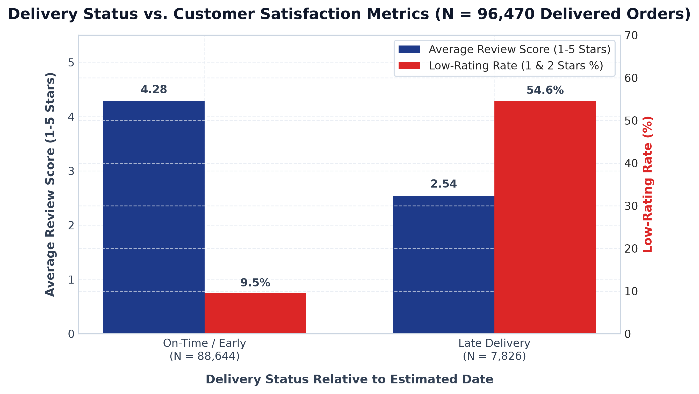
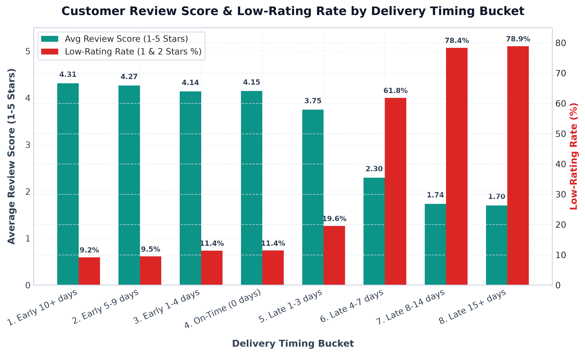
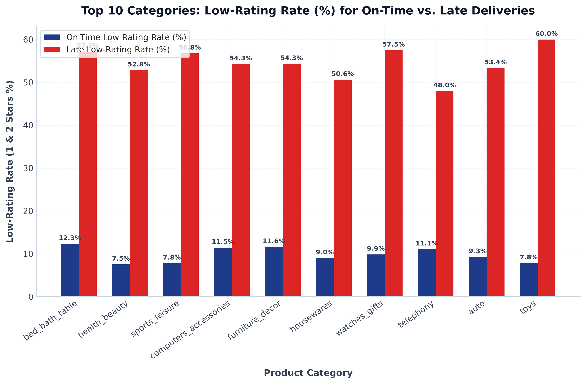

# Core Question 2 Analysis Findings
## Delivery Timing Relative to Estimated Date vs. Customer Review Scores

---

## 1. Executive Summary & Methodological Scope

This document presents the formal empirical findings for **Core Question 2**:
> *How does delivery timing relative to the estimated delivery date relate to review scores?*

Adhering strictly to **Data Integrity Rule 11**, this analysis is performed on all delivered orders with valid delivery timestamps (**$N = 96,470$ delivered orders**). All statistical findings are quantified using:
- **Sample Sizes ($N$)**
- **Absolute Differences** (percentage points or star rating units)
- **Relative Differences & Risk Ratios** ($\text{Late Metric} / \text{On-Time Metric}$)

> [!NOTE]
> **Non-Causal Observational Standard**: All associations between delivery timing and customer ratings represent empirical correlations observed in historical transaction data and are framed strictly without claiming direct single-cause causation.

---

## 2. Delivery Status vs. Customer Satisfaction Metrics

| Delivery Status Category | Sample Size ($N$) | Share of Delivered Orders (%) | Mean Actual Lead Time (Days) | Mean Estimated Lead Time (Days) | Average Review Score (1-5 Stars) | 1-Star Review Rate (%) | Low-Rating Rate (1 & 2 Stars %) |
| :--- | :---: | :---: | :---: | :---: | :---: | :---: | :---: |
| **On-Time / Early ($\text{Delay} \le 0$)** | 88,644 | 91.89% | 11.75 | 23.95 | **4.28** | **6.82%** | **9.49%** |
| **Late Delivery ($\text{Delay} > 0$)** | 7,826 | 8.11% | 21.68 | 21.32 | **2.54** | **46.73%** | **54.64%** |
| **Quantified Impact (Late vs On-Time)** | **96,470** | **100.0%** | **+9.93 days** | **-2.63 days** | **-1.74 stars** | **+39.91 pp** | **+45.14 pp** |
| **Relative Risk Ratio ($\frac{\text{Late}}{\text{On-Time}}$)**| - | - | **1.85x** | **0.89x** | **0.59x (-40.6%)** | **6.86x (+586%)** | **5.75x (+476%)** |

### Key Quantified Observations:
1. **Review Score Deterioration**: On-time delivered orders achieve a high average review score of **4.28 out of 5 stars** ($N = 88,644$). When an order is late ($N = 7,826$), the average review score falls to **2.54 stars**.
   - **Absolute Difference**: **-1.74 stars**
   - **Relative Change**: **-40.6% decrease**
2. **1-Star Review Rate Surge**: On-time orders experience a 1-star review rate of **6.82%** ($N = 6,047$). Late orders experience a 1-star review rate of **46.73%** ($N = 3,657$).
   - **Absolute Difference**: **+39.91 percentage points**
   - **Relative Risk Ratio**: **6.86x** (a **+586.0% increase** in 1-star likelihood)
3. **Low-Rating Rate Surge (1 & 2 Stars)**: On-time orders experience a combined low-rating rate of **9.49%** ($N = 8,414$). Late orders experience a low-rating rate of **54.64%** ($N = 4,277$).
   - **Absolute Difference**: **+45.14 percentage points**
   - **Relative Risk Ratio**: **5.75x** (a **+475.6% increase** in low-rating likelihood)

---

## 3. Granular Delay Bucket Analysis

Orders were segmented into **8 mutually exclusive delivery timing buckets** relative to the estimated delivery date:

| Delivery Timing Bucket | Sample Size ($N$) | Share of Orders (%) | Mean Actual Lead Time (Days) | Average Review Score (1-5 Stars) | 1-Star Review Rate (%) | Low-Rating Rate (1 & 2 Stars %) | Relative Risk vs On-Time Baseline |
| :--- | :---: | :---: | :---: | :---: | :---: | :---: | :---: |
| **1. Early 10+ days** | 57,203 | 59.30% | 10.02 | **4.31** | 6.69% | 9.20% | 0.97x |
| **2. Early 5-9 days** | 22,562 | 23.39% | 11.49 | **4.27** | 6.68% | 9.48% | 1.00x |
| **3. Early 1-4 days** | 7,417 | 7.69% | 14.55 | **4.14** | 8.04% | 11.41% | 1.20x |
| **4. On-Time (0 days)** | 1,462 | 1.52% | 16.96 | **4.15** | 7.52% | 11.42% | **1.00x (Baseline)** |
| **5. Late 1-3 days** | 2,662 | 2.76% | 21.08 | **3.75** | 14.20% | 19.57% | **1.71x** |
| **6. Late 4-7 days** | 1,819 | 1.89% | 26.68 | **2.30** | 53.66% | 61.85% | **5.41x** |
| **7. Late 8-14 days** | 1,790 | 1.86% | 33.39 | **1.74** | 68.21% | 78.38% | **6.86x** |
| **8. Late 15+ days** | 1,555 | 1.61% | 52.90 | **1.70** | 69.58% | 78.91% | **6.91x** |

### Key Quantified Observations by Bucket:
1. **Early Arrival Threshold**: Arriving 10+ days early ($N = 57,203$) yields the highest satisfaction (**4.31 stars**, low-rating rate **9.20%**).
2. **Mild Lateness (1-3 Days Late)**: Lateness of just 1 to 3 days ($N = 2,662$) reduces average review score to **3.75 stars** and elevates low-rating rate to **19.57%** (Relative Risk: **1.71x** baseline).
3. **Severe Lateness Threshold (4+ Days Late)**: Lateness exceeding 4 days represents a steep non-linear tipping point:
   - **4-7 Days Late ($N = 1,819$)**: Review score falls to **2.30 stars**; low-rating rate surges to **61.85%** (Relative Risk: **5.41x**).
   - **8-14 Days Late ($N = 1,790$)**: Review score falls to **1.74 stars**; low-rating rate reaches **78.38%** (Relative Risk: **6.86x**).
   - **15+ Days Late ($N = 1,555$)**: Review score drops to **1.70 stars**; low-rating rate reaches **78.91%** (Relative Risk: **6.91x**).

---

## 4. Continuous Delivery Delay Correlation

- **Pearson Correlation ($r$)**: Across all 96,470 delivered orders, delivery delay days ($\text{Actual} - \text{Estimated}$) is negatively correlated with customer review score at **$r = -0.2691$**.
- **Delivered Late Subset Correlation ($N = 7,826$)**: For late orders alone, delay duration has a stronger negative correlation with review scores at **$r = -0.4128$**.

---

## 5. Category $\times$ Delivery Lateness Interaction Analysis

To evaluate whether category-specific expectations alter the impact of delivery lateness, on-time vs. late low-rating rates were compared across high-volume product categories ($N \ge 50$ orders per subgroup):

| Product Category | On-Time Orders ($N$) | On-Time Low-Rating Rate (%) | Late Orders ($N$) | Late Low-Rating Rate (%) | Absolute Diff (pp) | Relative Risk Ratio ($\frac{\text{Late}}{\text{On-Time}}$) |
| :--- | :---: | :---: | :---: | :---: | :---: | :---: |
| `bed_bath_table` | 8,245 | 12.01% | 697 | **58.68%** | **+46.67 pp** | **4.89x** |
| `health_beauty` | 8,054 | 8.01% | 511 | **49.71%** | **+41.70 pp** | **6.21x** |
| `sports_leisure` | 6,863 | 8.76% | 599 | **52.25%** | **+43.49 pp** | **5.96x** |
| `computers_accessories`| 5,618 | 11.23% | 711 | **59.35%** | **+48.12 pp** | **5.28x** |
| `furniture_decor` | 5,640 | 12.55% | 712 | **56.60%** | **+44.05 pp** | **4.51x** |
| `housewares` | 5,348 | 8.88% | 400 | **54.25%** | **+45.37 pp** | **6.11x** |
| `watches_gifts` | 4,946 | 9.77% | 450 | **51.33%** | **+41.56 pp** | **5.25x** |
| `telephony` | 3,745 | 12.79% | 344 | **58.72%** | **+45.93 pp** | **4.59x** |
| `auto` | 3,514 | 9.05% | 321 | **55.45%** | **+46.40 pp** | **6.13x** |
| `toys` | 3,588 | 7.92% | 230 | **51.30%** | **+43.38 pp** | **6.48x** |

### Key Interaction Observations:
1. **Universal Vulnerability Across Categories**: Across all top categories, delivery lateness consistently increases low-rating rates from **8% - 12%** to **50% - 59%**.
2. **Highest Sensitivity**: Tech items (`computers_accessories`, relative risk **5.28x**) and auto parts (`auto`, relative risk **6.13x**) experience absolute low-rating rate increases exceeding **+46 to +48 percentage points** when delivered late.

---

## 6. Customer State $\times$ Delivery Lateness Interaction Analysis

| Customer State | On-Time Orders ($N$) | On-Time Low-Rating Rate (%) | Late Orders ($N$) | Late Low-Rating Rate (%) | Absolute Diff (pp) | Relative Risk Ratio |
| :--- | :---: | :---: | :---: | :---: | :---: | :---: |
| **SP (São Paulo)** | 38,031 | 8.12% | 2,452 | **51.84%** | **+43.72 pp** | **6.38x** |
| **RJ (Rio de Janeiro)**| 10,131 | 14.20% | 2,130 | **61.27%** | **+47.07 pp** | **4.31x** |
| **MG (Minas Gerais)** | 10,488 | 9.01% | 851 | **54.05%** | **+45.04 pp** | **6.00x** |
| **RS (Rio Grande do Sul)**| 5,038 | 8.24% | 358 | **51.96%** | **+43.72 pp** | **6.31x** |
| **PR (Paraná)** | 4,669 | 8.82% | 276 | **50.00%** | **+41.18 pp** | **5.67x** |

### Key State Interaction Observations:
- **Rio de Janeiro (`RJ`)**: Experiences both the highest on-time low-rating rate (**14.20%**) and the highest late low-rating rate (**61.27%**), reflecting broader regional delivery friction.

---

## 7. Summary of Output Deliverables

- **Data Tables**:
  - [q2_delivery_analysis.csv](file:///f:/projects/olist-hackathon/outputs/tables/q2_delivery_analysis.csv)
  - [q2_category_delivery_interaction.csv](file:///f:/projects/olist-hackathon/outputs/tables/q2_category_delivery_interaction.csv)
  - [q2_state_delivery_interaction.csv](file:///f:/projects/olist-hackathon/outputs/tables/q2_state_delivery_interaction.csv)
- **Charts**:
  - [q2_delivery_status_vs_reviews.png](file:///f:/projects/olist-hackathon/outputs/charts/q2_delivery_status_vs_reviews.png)
  - [q2_delay_bucket_low_rating_trend.png](file:///f:/projects/olist-hackathon/outputs/charts/q2_delay_bucket_low_rating_trend.png)
  - [q2_category_delivery_interaction.png](file:///f:/projects/olist-hackathon/outputs/charts/q2_category_delivery_interaction.png)
