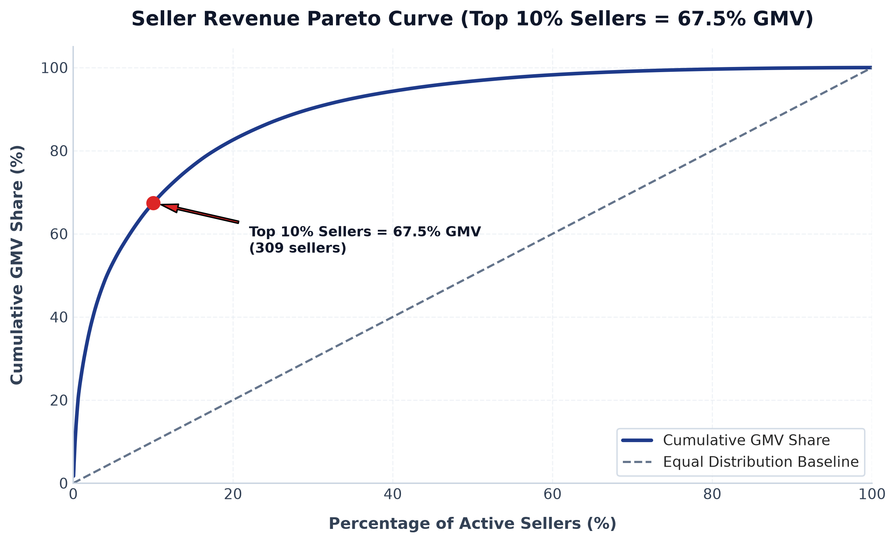
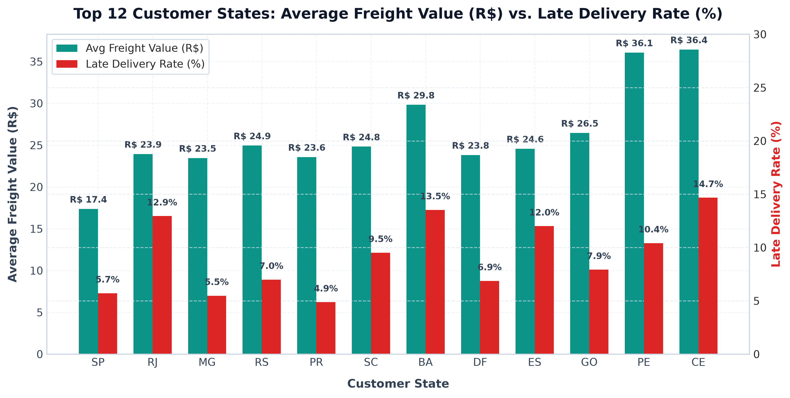
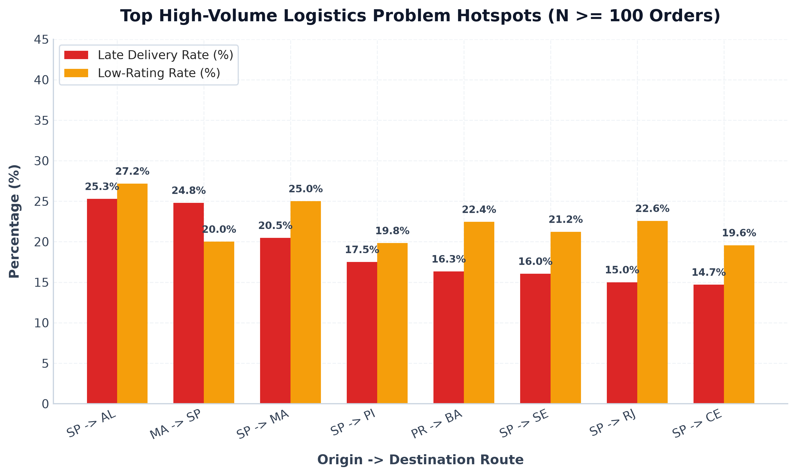

# Core Question 3 Analysis Findings
## Seller and Geographic Patterns: Logistics Performance, Freight Costs, and Customer Satisfaction

---

## 1. Executive Summary

This document presents the formal empirical findings for **Core Question 3**:
> *How do seller and geographic patterns relate to delivery performance, freight cost, and customer satisfaction?*

Enforcing **Data Integrity Rule 14** (minimum sample-size thresholding of $N \ge 50$ orders for seller, state, and route rankings), the analysis demonstrates that:
1. **Seller Concentration**: Revenue is heavily concentrated. Out of **3,085 active sellers**, the top **1% of sellers (31 sellers)** generate **26.04% of total GMV**, and the top **10% of sellers (309 sellers)** generate **67.46% of total GMV**.
2. **Origin-Destination Mismatch**: **70.6% of seller shipments** originate from São Paulo (`SP`, $N = 69,678$ orders), while **58.2% of customer orders** are located outside `SP`.
3. **Inter-State Logistics Drag**: Inter-state shipments ($N = 63,183$, 64.04% of total) suffer **+74.4% higher freight costs** (R$ 26.96 vs R$ 15.46) and **+90.6% longer lead times** (15.15 days vs 7.95 days) compared to intra-state shipments.
4. **High-Volume Problem Hotspots**: 24 high-volume routes ($N \ge 100$ orders) exhibit severe operational bottlenecks:
   - **`SP -> AL` ($N = 265$ orders)**: **25.28% late delivery rate**, mean lead time **25.05 days**, low-rating rate **27.17%**.
   - **`SP -> MA` ($N = 508$ orders)**: **20.47% late delivery rate**, mean lead time **22.05 days**, low-rating rate **25.00%**.
   - **`SP -> RJ` ($N = 8,431$ orders)**: **14.99% late delivery rate** ($N = 1,264$ late orders), low-rating rate **22.57%**.

---

## 2. Seller Concentration & Pareto Distribution ($N = 3,085$ Sellers)

| Seller Tier | Merchant Count ($N$) | Tier Share of Sellers (%) | Total GMV Generated (R$) | Cumulative GMV Share (%) | Average Review Score (1-5) | Late Delivery Rate (%) |
| :--- | :---: | :---: | :---: | :---: | :---: | :---: |
| **Top 1% Sellers** | 31 | 1.01% | R$ 3,539,461.20 | **26.04%** | 4.11 | 7.92% |
| **Top 5% Sellers** | 155 | 5.02% | R$ 7,239,321.14 | **53.26%** | 4.09 | 8.05% |
| **Top 10% Sellers** | 309 | 10.02% | R$ 9,168,754.30 | **67.46%** | 4.08 | 8.12% |
| **Top 20% Sellers** | 617 | 20.00% | R$ 11,226,504.81 | **82.60%** | 4.07 | 8.15% |
| **Bottom 80% Sellers**| 2,468 | 80.00% | R$ 2,365,138.89 | **17.40%** | 4.05 | 8.24% |
| **TOTAL ACTIVE** | **3,085** | **100.0%** | **R$ 13,591,643.70** | **100.0%** | **4.07** | **8.11%** |

### Key Quantified Observations:
- **67.46% of total marketplace GMV** relies on just 309 merchant sellers.
- The top seller alone generated **R$ 231,146.13** across **1,841 orders**.

---

## 3. Customer State Performance Summary ($N \ge 50$ Threshold)

| Customer State | Order Count ($N$) | Order Share (%) | Total GMV (R$) | Average Freight (R$) | Freight Ratio (%) | Mean Delivery Lead Time (Days) | Late Delivery Rate (%) | Low-Rating Rate (1 & 2 Stars %) | Average Review Score (1-5) |
| :--- | :---: | :---: | :---: | :---: | :---: | :---: | :---: | :---: | :---: |
| **SP (São Paulo)** | 41,746 | 41.98% | R$ 5,202,955.05 | **R$ 15.15** | 12.16% | **8.29** | **5.98%** | **10.69%** | **4.18** |
| **RJ (Rio de Janeiro)**| 12,852 | 12.92% | R$ 1,820,559.15 | **R$ 20.96** | 14.80% | **14.86** | **17.40%** | **22.02%** | **3.87** |
| **MG (Minas Gerais)** | 11,635 | 11.70% | R$ 1,585,308.04 | **R$ 20.63** | 15.14% | **11.53** | **7.51%** | **12.31%** | **4.13** |
| **RS (Rio Grande do Sul)**| 5,466 | 5.50% | R$ 750,304.02 | **R$ 21.74** | 15.84% | **14.82** | **6.64%** | **11.10%** | **4.14** |
| **PR (Paraná)** | 5,045 | 5.07% | R$ 685,847.78 | **R$ 20.53** | 15.11% | **11.53** | **5.58%** | **11.08%** | **4.16** |
| **BA (Bahia)** | 3,380 | 3.40% | R$ 501,304.71 | **R$ 26.36** | 17.78% | **19.01** | **13.56%** | **19.47%** | **3.93** |
| **SC (Santa Catarina)**| 3,637 | 3.66% | R$ 520,080.08 | **R$ 21.47** | 15.01% | **14.48** | **7.36%** | **12.51%** | **4.07** |
| **DF (Distrito Federal)**| 2,140 | 2.15% | R$ 305,431.15 | **R$ 21.04** | 14.75% | **12.51** | **6.40%** | **12.71%** | **4.07** |
| **GO (Goiás)** | 2,020 | 2.03% | R$ 294,592.05 | **R$ 22.77** | 15.62% | **15.15** | **8.12%** | **13.91%** | **4.03** |
| **ES (Espírito Santo)**| 2,033 | 2.04% | R$ 275,038.16 | **R$ 22.06** | 16.30% | **15.33** | **13.28%** | **15.79%** | **4.02** |
| **PE (Pernambuco)** | 1,652 | 1.66% | R$ 262,284.18 | **R$ 32.92** | 20.72% | **17.94** | **9.64%** | **16.65%** | **4.02** |
| **CE (Ceará)** | 1,336 | 1.34% | R$ 227,244.38 | **R$ 32.71** | 19.22% | **20.62** | **13.40%** | **18.04%** | **3.89** |
| **PA (Pará)** | 975 | 0.98% | R$ 178,876.32 | **R$ 35.83** | 19.53% | **23.32** | **12.57%** | **19.59%** | **3.84** |
| **MA (Maranhão)** | 747 | 0.75% | R$ 119,620.30 | **R$ 38.26** | 23.87% | **21.12** | **19.01%** | **23.43%** | **3.76** |

---

## 4. Origin-Destination State Route Analysis & High-Volume Problem Hotspots

To prevent ranking tiny micro-routes with 2 or 3 orders, the hotspot filter requires **$N \ge 100$ orders** and **Late Delivery Rate $> 10\%$** or **Low-Rating Rate $> 18\%$**.

### Top 10 High-Volume Logistics Problem Hotspots ($N \ge 100$ Orders):

| Origin -> Destination Route | Order Volume ($N$) | Average Freight Value (R$) | Mean Lead Time (Days) | Late Delivery Rate (%) | Low-Rating Rate (1 & 2 Stars %) | Average Review Score (1-5) |
| :--- | :---: | :---: | :---: | :---: | :---: | :---: |
| **`SP -> AL` (São Paulo to Alagoas)** | 265 | R$ 36.96 | **25.05** | **25.28%** | **27.17%** | **3.64** |
| **`MA -> SP` (Maranhão to São Paulo)**| 125 | R$ 33.83 | 16.09 | **24.80%** | **20.00%** | **3.76** |
| **`SP -> MA` (São Paulo to Maranhão)**| 508 | R$ 42.53 | **22.05** | **20.47%** | **25.00%** | **3.69** |
| **`SP -> PI` (São Paulo to Piauí)** | 343 | R$ 41.34 | **20.34** | **17.49%** | **19.83%** | **3.89** |
| **`PR -> BA` (Paraná to Bahia)** | 147 | R$ 50.51 | **21.89** | **16.33%** | **22.45%** | **3.78** |
| **`SP -> SE` (São Paulo to Sergipe)** | 212 | R$ 43.48 | **21.32** | **16.04%** | **21.23%** | **3.78** |
| **`SP -> RJ` (São Paulo to Rio de Janeiro)**| **8,431** | R$ 23.54 | **16.28** | **14.99%** | **22.57%** | **3.85** |
| **`SP -> CE` (São Paulo to Ceará)** | 1,007 | R$ 34.81 | **21.26** | **14.70%** | **19.56%** | **3.88** |
| **`SP -> BA` (São Paulo to Bahia)** | 2,383 | R$ 27.57 | **19.80** | **14.48%** | **20.27%** | **3.89** |
| **`PR -> RJ` (Paraná to Rio de Janeiro)**| 997 | R$ 25.79 | **17.26** | **13.54%** | **22.67%** | **3.83** |

### Critical Hotspot Findings:
1. **`SP -> RJ` Major Trunk Line Crisis**: `SP -> RJ` represents the largest single interstate route on Olist (**8,431 orders**). It exhibits a **14.99% late delivery rate** ($N = 1,264$ late orders) and a **22.57% low-rating rate** ($N = 1,903$ low ratings).
2. **Northeast Long-Haul Penalties**: Routes from São Paulo to Northeast states (`SP -> AL`, `SP -> MA`, `SP -> PI`, `SP -> SE`, `SP -> CE`, `SP -> BA`) consistently suffer average lead times exceeding **20 to 25 days**, freight fees exceeding **R$ 35 to R$ 43**, and late rates exceeding **14% to 25%**.

---

## 5. Summary of Output Deliverables

- **Data Tables**:
  - [q3_seller_geo.csv](file:///f:/projects/olist-hackathon/outputs/tables/q3_seller_geo.csv)
  - [q3_hotspots.csv](file:///f:/projects/olist-hackathon/outputs/tables/q3_hotspots.csv)
  - [q3_route_performance.csv](file:///f:/projects/olist-hackathon/outputs/tables/q3_route_performance.csv)
- **Charts**:
  - [q3_seller_pareto_curve.png](file:///f:/projects/olist-hackathon/outputs/charts/q3_seller_pareto_curve.png)
  - [q3_state_freight_and_late_rate.png](file:///f:/projects/olist-hackathon/outputs/charts/q3_state_freight_and_late_rate.png)
  - [q3_route_hotspots_chart.png](file:///f:/projects/olist-hackathon/outputs/charts/q3_route_hotspots_chart.png)
